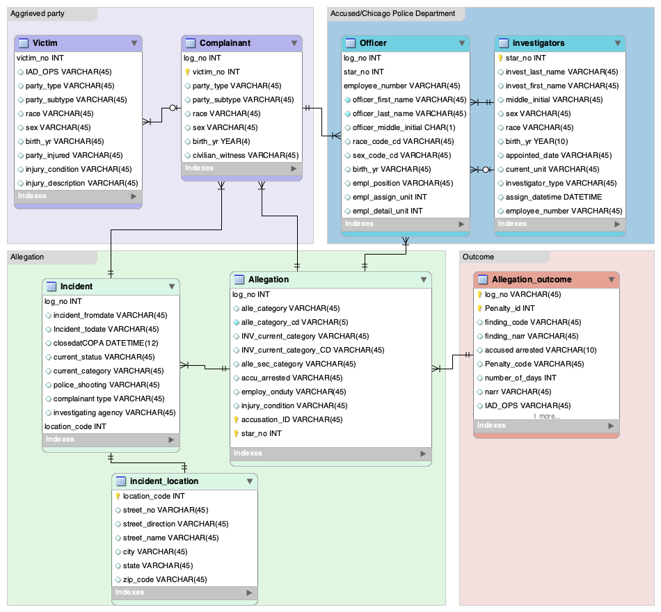
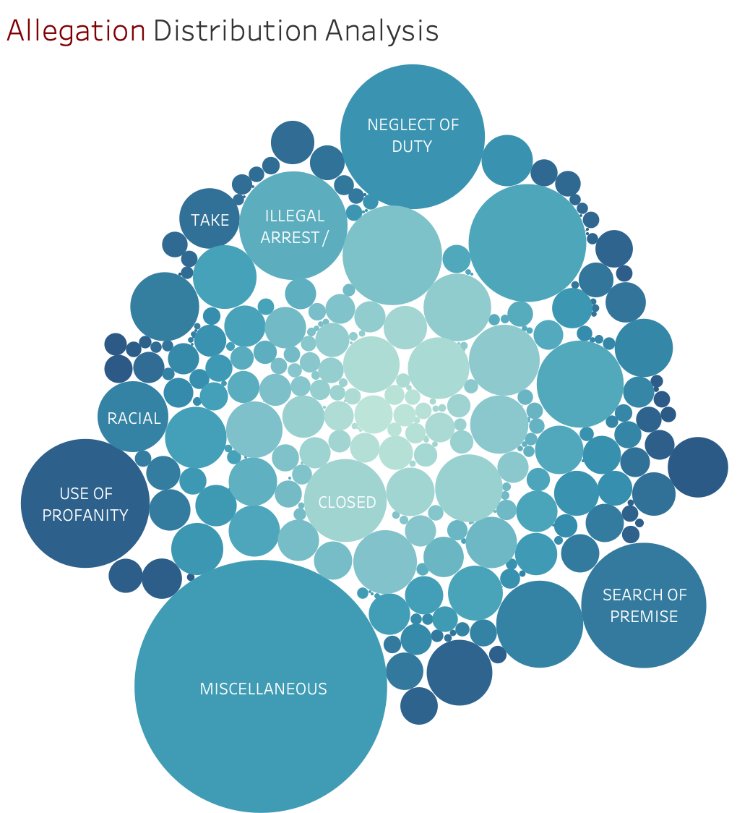
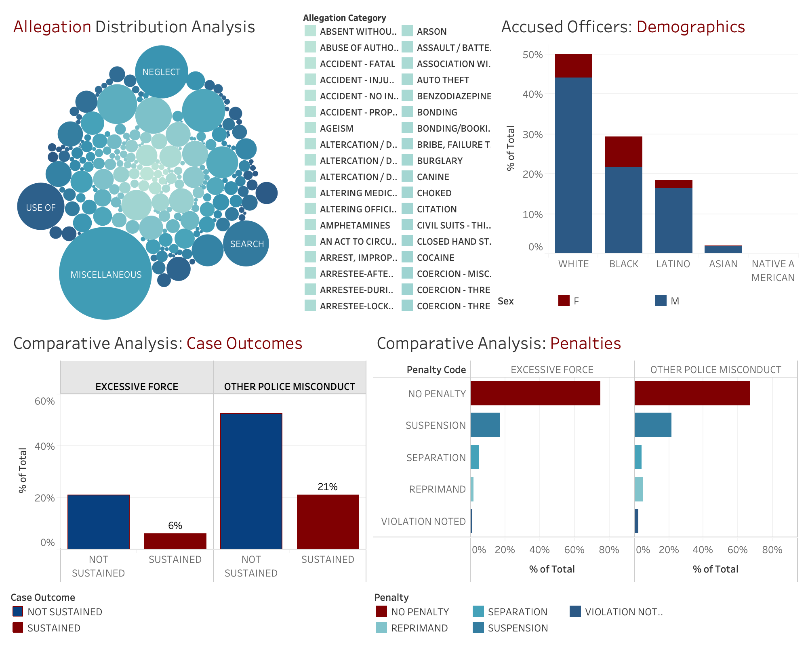

```{r setup, include=FALSE}
knitr::opts_chunk$set(echo = TRUE)
```


# I. Research Objectives

The current landscape of police brutality in the city of Chicago has community leaders, policy makers, and the public asking what can be done to prevent more deaths. Data plays a central role in helping to shed light around the excessive use-of-force and racially-motivated patterns of violence.

Our foundational research objective is to analyze data regarding police misconduct and accountability in Chicago. We endeavor to understand the nature, extent, and correlations between city demographics and police misconduct. Using the datasets provided by the Invisible Institute, we hope to provide insights on how these complaints impact Chicagoans geographically and demographically. 

# II. Methodology

The data for our project was obtained from the Civilian Office of Police Accountability (COPA) via a Freedom of Information Act (FOIA) request made by the Invisible Institute. The data obtained contained a total of 7 datasets.

### Data Preparation 

#### Loaded Required Libraries
The first step was to load both the data and the required libraries into R.

```{r}
library(tidyverse)
library(janitor)
library(skimr)
library(RMySQL)
library(keyring)
library(odbc)
library(readxl)
library(RSQLite)
library(dbplyr)
library(dplyr)
library(ggplot2)
library(esquisse)
library(modeldata)
library(sqldf)
library(RColorBrewer)
library(reshape2)
library(rpivotTable)
```

#### Uploaded the datasets
```{r}
df_accused <- read_excel("accused.xlsx") 
```

```{r}
df_case_info <- read_excel("case_info.xlsx") 
```

```{r}
df_civilian_witness <- read_excel("civilian_witness.xlsx") 
```

```{r}
df_complainant <- read_excel("complainant.xlsx") 
```

```{r}
df_cpd_witness <- read_excel("cpd_witness.xlsx") 
```

```{r eval=FALSE}
df_investigators <- read_excel("investigators.xlsx") 
```

```{r}
df_victim <- read_excel("victim.xlsx") 
```

##### Removed duplicates

The distinct_df_accused provides a dataframe without duplicates. 

```{r}
distinct_df_accused <- distinct(df_accused)
```

```{r}
anyDuplicated(distinct_df_accused)
```

##### Identified Columns with 50%+ missing values

```{r}
columns_missing_most_data <- distinct_df_accused %>%
  summarise(across(everything(), ~ skimr::n_missing(.x))) %>%
  pivot_longer(cols = everything(),
               names_to = "variable",
               values_to = "missing_count") %>% 
  mutate(proportion_missing = round(missing_count / nrow(df_accused), 2)) %>% 
  arrange(desc(missing_count)) %>% 
  # Detect columns that were missing more than 50% of the data
  filter(proportion_missing > .5) %>% 
  pull(variable)

print(message("Columns missing 50%+ data:"))
columns_missing_most_data
```

### Normalization

#### First Normal Form

The CPD datasets were in First Normal Form, with all entries being single-valued and atomic. 

###### Trimmed White Spaces 

```{r eval=FALSE}
df_accused %>% 
  janitor::clean_names()
```
###### Converted NA Values

```{r}
distinct_df_accused <- df_accused  %>%
  mutate_all(.%>%str_trim) %>%
  mutate_all(na_if,"")

distinct_df_accused
```
###### Created 1NF Dataframe

```{r}
df_1nf <- distinct_df_accused %>%
  select(LOG_NO,OFFICER_FIRST_NAME, OFFICER_LAST_NAME, MIDDLE_INITIAL, RACE_CODE_CD, SEX_CODE_CD, BIRTH_YEAR, STAR_NO,EMPLOYEE_NO, EMPLOYEE_POSITION, ALLEGATION_CATEGORY, ALLEGATION_CATEGORY_CD,INV_CURRENT_CATEGORY, INV_CURRENT_CATEGORY_CD,EMPLOYEE_POSITION, EMPLOYEE_ASSIGN_UNIT, EMPLOYEE_DETAIL_UNIT, ACCUSED_ARRESTED,EMPLOYEE_ON_DUTY,INJURY_CONDITION,FINDING_CODE,FINDING_NARRATIVE,ACCUSATION_ID,PENALTY_ID, PENALTY_CODE,NO_OF_DAYS,NARRATIVE,IAD_OPS, CR_REQUIRED)

df_1nf
```

#### Second Normal Form

The next step was to create dataframes of the primary keys in the dataset.

##### LOG_NO Primary Key

```{r}
log_no_pk <- df_1nf %>% select (LOG_NO, RACE_CODE_CD, SEX_CODE_CD, STAR_NO,EMPLOYEE_NO, ALLEGATION_CATEGORY_CD,INV_CURRENT_CATEGORY_CD, ACCUSED_ARRESTED, INJURY_CONDITION, FINDING_CODE, ACCUSATION_ID,PENALTY_ID, PENALTY_CODE,NO_OF_DAYS,NARRATIVE,IAD_OPS, CR_REQUIRED)
```

##### STAR_NO Primary Key
A secondary primary key surfaced in the data, in the "PENALTY_ID" column. 

```{r}
star_no_pk <- df_1nf %>% select (STAR_NO, OFFICER_FIRST_NAME, OFFICER_LAST_NAME, MIDDLE_INITIAL, BIRTH_YEAR, EMPLOYEE_NO, EMPLOYEE_POSITION)
```

##### EMPLOYEE_NO Primary Key
The third primary key in the data was EMPLOYEE_NO.

```{r}
employee_no_pk <- df_1nf %>% select (EMPLOYEE_NO, OFFICER_FIRST_NAME, OFFICER_LAST_NAME, MIDDLE_INITIAL, BIRTH_YEAR, EMPLOYEE_POSITION, STAR_NO)
```

##### ACCUSATION_ID Primary Key
The fourth primary key in the data was ACCUSATION_ID.

```{r}
accusation_id_pk <- df_1nf %>% select (ACCUSATION_ID, ALLEGATION_CATEGORY, ALLEGATION_CATEGORY_CD,INV_CURRENT_CATEGORY, INV_CURRENT_CATEGORY_CD, ACCUSED_ARRESTED, NO_OF_DAYS)
```

##### PENALTY_ID Primary Key
The fourth primary key in the data was PENALTY_ID.

```{r}
penalty_id_pk <- df_1nf %>% select (PENALTY_ID, PENALTY_CODE, NO_OF_DAYS, NARRATIVE)
```

#### Third Normal Form

For 3NF we then grouped the data to ensure the columns were non-transitively dependent on the primary key. This included identifying: race code, sex code, allegation code, investigation code, finding code, and penalty code.

##### Race Code
Renamed the race codes for clarity
```{r}
distinct_df_accused <- distinct_df_accused %>% 
  mutate(RACE_CODE_CD = ifelse(
    RACE_CODE_CD == "WHI", "WHITE", RACE_CODE_CD))
```

```{r}
distinct_df_accused <- distinct_df_accused %>% 
  mutate(RACE_CODE_CD = ifelse(
    RACE_CODE_CD == "BLK", "BLACK", RACE_CODE_CD))
```

```{r}
distinct_df_accused <- distinct_df_accused %>% 
  mutate(RACE_CODE_CD = ifelse(
    RACE_CODE_CD == "WWH", "LATINO", RACE_CODE_CD))
```

```{r}
distinct_df_accused <- distinct_df_accused %>% 
  mutate(RACE_CODE_CD = ifelse(
    RACE_CODE_CD == "API", "ASIAN", RACE_CODE_CD))
```

```{r}
distinct_df_accused <- distinct_df_accused %>% 
  mutate(RACE_CODE_CD = ifelse(
    RACE_CODE_CD == "I", "NATIVE AMERICAN", RACE_CODE_CD))
```

```{r}
distinct_df_accused <- distinct_df_accused %>% 
  mutate(RACE_CODE_CD = ifelse(
    RACE_CODE_CD == "U", "UNIDENTIFIED", RACE_CODE_CD))
```

```{r}
distinct_df_accused <- distinct_df_accused %>% 
  mutate(RACE_CODE_CD = ifelse(
    RACE_CODE_CD == "S", "LATINO", RACE_CODE_CD))
```

```{r}
race_code_3nf <- distinct_df_accused %>% select (RACE_CODE_CD)
```

```{r}
count(distinct_df_accused, RACE_CODE_CD) %>% arrange(desc(n))
```

##### Sex Code
```{r}
sex_code_3nf <- distinct_df_accused %>% select (SEX_CODE_CD)
```

```{r}
count(distinct_df_accused, SEX_CODE_CD) %>% arrange(desc(n))
```

##### Allegation Code
```{r}
allegation_code_3nf <- distinct_df_accused %>% select (ALLEGATION_CATEGORY_CD, ALLEGATION_CATEGORY)
```

##### Investigation Category Code
```{r}
investigation_code_3nf <- distinct_df_accused %>% select (INV_CURRENT_CATEGORY_CD, INV_CURRENT_CATEGORY)
```

##### Finding Code
```{r}
finding_code_3nf <- distinct_df_accused %>% select (FINDING_CODE, FINDING_NARRATIVE)
```

##### Penalty Code
```{r}
penalty_code_3nf <- distinct_df_accused %>% select (PENALTY_ID,PENALTY_CODE, NO_OF_DAYS, NARRATIVE)
```

### EER Model

We analyzed a total of 7 datasets to build the EER Model in SQL. The tables were partitioned by aggrieved party, accused/CPD, allegation, and outcome.



# III. Data Analysis

### Report I. Officer Demographic Data

In preparation for the report, we created a percentage function to be able to see percentage data alongside the count functions.

```{r}
count_pct <- function(distinct_df_accused) {
  return(
    distinct_df_accused %>%
      tally %>% 
      mutate(n_pct = 100*n/sum(n))
  )
}
```

The demographics data for accused officers showed that 41% of officers accused were White, 24% were Black, and 15% were Latino.

```{r}
distinct_df_accused %>% 
  group_by(RACE_CODE_CD) %>% 
  count_pct %>% 
  arrange(desc(n))
```
Next, we looked at sex data for the accused officers. The data found that 69% of officers accused were male and 13% were female. This does not necessarily imply that males are more likely to be accused of misconduct, it may mean that the universe of demographics for Chicago Police may have a larger percentage of males overall.

```{r}
distinct_df_accused %>% 
  group_by(SEX_CODE_CD) %>% 
  count_pct %>% 
  arrange(desc(n))
```

```{r}
distinct_df_accused %>%
 filter(!(RACE_CODE_CD %in% "UNIDENTIFIED") | is.na(RACE_CODE_CD)) %>%
 filter(!is.na(SEX_CODE_CD)) %>%
 ggplot() +
  aes(x = RACE_CODE_CD) +
  geom_bar(fill="#B22222", aes(y =(..count..)/sum(..count..))) +
  scale_y_continuous(labels=scales::percent) +
  labs(
    x = "Race Categories",
    y = "Total Number",
    title = "Demographics of Accused Officers",
    subtitle = "Segmentation by Race and Gender"
  ) +
  coord_flip() +
  theme_gray() +
  facet_wrap(vars(SEX_CODE_CD))
```

### Report II. Allegation Data Insights

#### Top Allegations 

```{r}
top_allegations <- count(distinct_df_accused, ALLEGATION_CATEGORY) %>% arrange(desc(n))
```

```{r}
distinct_df_accused %>% 
  group_by(ALLEGATION_CATEGORY) %>% 
  count(ALLEGATION_CATEGORY) %>% 
  arrange(desc(n))
```



#### Creating a grouping category for the Excessive Use of Force values
Since the allegations data rendered 281 categories, we reviewed the data and found that many of the entries were not properly categorized. We created a new dataframe for the Excessive Use of Force data by renaming categories listed as: injury, excessive, abuse, punch, choked, kicked, death, murder, etc.

##### Use of Excessive Force Dataframe
```{r}
excessive_force_df <-  mutate(distinct_df_accused, NEW_ALLEGATION_CATEGORY =
             ifelse(grepl("INJURY", ALLEGATION_CATEGORY), "EXCESSIVE_USE_OF_FORCE",
             ifelse(grepl("COERCION", ALLEGATION_CATEGORY), "EXCESSIVE_USE_OF_FORCE",
             ifelse(grepl("EXCESSIVE", ALLEGATION_CATEGORY), "EXCESSIVE_USE_OF_FORCE",
             ifelse(grepl("ASSAULT", ALLEGATION_CATEGORY), "EXCESSIVE_USE_OF_FORCE",
             ifelse(grepl("ABUSE", ALLEGATION_CATEGORY), "EXCESSIVE_USE_OF_FORCE",
             ifelse(grepl("PUNCH", ALLEGATION_CATEGORY), "EXCESSIVE_USE_OF_FORCE",
             ifelse(grepl("CHOKED", ALLEGATION_CATEGORY), "EXCESSIVE_USE_OF_FORCE",
             ifelse(grepl("DRAGGED", ALLEGATION_CATEGORY), "EXCESSIVE_USE_OF_FORCE",
             ifelse(grepl("STRIKE", ALLEGATION_CATEGORY), "EXCESSIVE_USE_OF_FORCE",
             ifelse(grepl("WEAPON", ALLEGATION_CATEGORY), "EXCESSIVE_USE_OF_FORCE",
             ifelse(grepl("KICKED", ALLEGATION_CATEGORY), "EXCESSIVE_USE_OF_FORCE",
             ifelse(grepl("PUSH", ALLEGATION_CATEGORY), "EXCESSIVE_USE_OF_FORCE",
             ifelse(grepl("STOMPED", ALLEGATION_CATEGORY), "EXCESSIVE_USE_OF_FORCE",      
             ifelse(grepl("THROWN", ALLEGATION_CATEGORY), "EXCESSIVE_USE_OF_FORCE",       
             ifelse(grepl("TASER", ALLEGATION_CATEGORY), "EXCESSIVE_USE_OF_FORCE",
             ifelse(grepl("FATAL", ALLEGATION_CATEGORY), "EXCESSIVE_USE_OF_FORCE",
             ifelse(grepl("DEATH", ALLEGATION_CATEGORY), "EXCESSIVE_USE_OF_FORCE",
             ifelse(grepl("MURDER", ALLEGATION_CATEGORY), "EXCESSIVE_USE_OF_FORCE",
             ifelse(grepl("CANINE", ALLEGATION_CATEGORY), "EXCESSIVE_USE_OF_FORCE",
             ifelse(grepl("PHYSICAL", ALLEGATION_CATEGORY), "EXCESSIVE_USE_OF_FORCE",              
             ifelse(grepl("UNJUSTIFIED", ALLEGATION_CATEGORY), "EXCESSIVE_USE_OF_FORCE",               
             ifelse(grepl("UNLAWFUL", ALLEGATION_CATEGORY), "EXCESSIVE_USE_OF_FORCE",
             ifelse(grepl("EXTREMITIES", ALLEGATION_CATEGORY), "EXCESSIVE_USE_OF_FORCE",
             ifelse(grepl("HITS", ALLEGATION_CATEGORY), "EXCESSIVE_USE_OF_FORCE",
             ifelse(grepl("DESTRUCTION", ALLEGATION_CATEGORY), "EXCESSIVE_USE_OF_FORCE",      
             ifelse(grepl("IMPROPER", ALLEGATION_CATEGORY), "EXCESSIVE_USE_OF_FORCE",              
             ifelse(grepl("VIOLENCE", ALLEGATION_CATEGORY), "EXCESSIVE_USE_OF_FORCE",               
             ifelse(grepl("UNLAWFUL", ALLEGATION_CATEGORY), "EXCESSIVE_USE_OF_FORCE",
             ifelse(grepl("EXTREMITIES", ALLEGATION_CATEGORY), "EXCESSIVE_USE_OF_FORCE",
             ifelse(grepl("HITS", ALLEGATION_CATEGORY), "EXCESSIVE_USE_OF_FORCE",
             ifelse(grepl("DESTRUCTION", ALLEGATION_CATEGORY), "EXCESSIVE_USE_OF_FORCE", "OTHER"                  
             ))))))))))))))))))))))))))))))))
```


27% of Allegations involve the Excessive Use of Force

```{r}
distinct_df_accused %>% distinct(ALLEGATION_CATEGORY)
```

```{r}
excessive_force_df %>% 
  group_by(NEW_ALLEGATION_CATEGORY) %>% 
  count_pct %>% 
  arrange(desc(n))
```
Segmentation of Allegations by Excessive Force

```{r}
ggplot(excessive_force_df) +
  aes(
    x = NEW_ALLEGATION_CATEGORY,
    fill = NEW_ALLEGATION_CATEGORY
  ) +
  geom_bar(aes(y =(..count..)/sum(..count..))) +
  scale_y_continuous(labels=scales::percent) +
  scale_fill_brewer(palette = "Set1", direction = 1) +
  labs(
    x = "Allegations",
    y = "Total %",
    title = "Allegation Segmentation",
    subtitle = "Excessive Use of Force"
  ) +
  theme_gray() +
  theme(legend.position = "bottom")
```

### Report III. Findings Data

```{r}
distinct_df_accused %>% 
  group_by(FINDING_CODE) %>% 
  count_pct %>% 
  arrange(desc(n))
```

```{r}
findings_df <-  mutate(excessive_force_df, NEW_FINDINGS_CATEGORY =
             ifelse(grepl("NA", FINDING_CODE), "NOT_SUSTAINED",
             ifelse(grepl("UNFOUNDED", FINDING_CODE), "NOT_SUSTAINED",
             ifelse(grepl("NOT SUSTAINED", FINDING_CODE), "NOT_SUSTAINED",
             ifelse(grepl("NO AFFIDAVIT", FINDING_CODE), "NOT_SUSTAINED",
             ifelse(grepl("ADDITIONAL", FINDING_CODE), "NOT_SUSTAINED",
             ifelse(grepl("EXONERATED", FINDING_CODE), "NOT_SUSTAINED",
"SUSTAINED"
)))))))
```


```{r}
distinct_df_accused %>%
 filter(!(FINDING_CODE %in% "ADDITIONAL INVESTIGATION REQUESTED") & !is.na(FINDING_CODE)) %>%
 ggplot() +
  aes(x = FINDING_CODE, fill = FINDING_CODE) +
  geom_bar(aes(y =(..count..)/sum(..count..))) +
  scale_y_continuous(labels=scales::percent) +
  scale_fill_manual(values = list(
 'EXONERATED' = "#CFE1F2", `NO AFFIDAVIT` = "#93C4DE", 
 `NOT SUSTAINED` = "#4A97C9", SUSTAINED = "#AB2E16", UNFOUNDED = "#CFE1F2")) +
  labs(
    x = "Case Findings",
    y = "Total %",
    title = "Case Findings for All Allegations"
  ) +
  theme_gray() +
  theme(legend.position = "bottom")
```

73% of cases are not sustained, meaning that the finding at the conclusion of the investigation where the allegation of misconduct was not proven to have occurred by a preponderance of the evidence and is determined to be either Unfounded, Lawful & Proper, Inconclusive, or Exonerated. 

```{r}
findings_df %>% 
  group_by(NEW_FINDINGS_CATEGORY) %>% 
  count_pct %>% 
  arrange(desc(n))
```

```{r}
findings_df %>%
 filter(!(FINDING_CODE %in% "ADDITIONAL INVESTIGATION REQUESTED") & !is.na(FINDING_CODE)) %>%
 ggplot() +
 aes(x = NEW_FINDINGS_CATEGORY, fill = FINDING_CODE) +
 geom_bar(aes(y =(..count..)/sum(..count..))) +
  scale_y_continuous(labels=scales::percent) +
 scale_fill_manual(values = list(
 `ADDITIONAL INVESTIGATION REQUESTED` = "#F7FBFF", EXONERATED = "#CFE1F2", `NO AFFIDAVIT` = "#93C4DE", 
 `NOT SUSTAINED` = "#4A97C9", SUSTAINED = "#AB2E16", UNFOUNDED = "#08306B")) +
 labs(x = "Case Findings", 
 y = "Total", title = "Case Outcomes for All Allegations") +
 theme_gray() +
 theme(legend.position = "bottom")
```

### Report IV. Top Penalties

The penalty data showed that 69% of allegations had no resulting penalty. The most frequent penalties reflected in the data were suspensions (20%), separation (4%), reprimand (4%), and violation noted (2%).

```{r}
penalty_id_pk %>% 
  group_by(PENALTY_CODE) %>% 
  count_pct %>% 
  arrange(desc(n))
```
This comparative penalty analysis outlines that in the 26% of cases with penalties, Officers were less likely to be penalized for allegations of excessive abuse, when compared to other allegations.

```{r}
excessive_force_df %>%
 filter(!(PENALTY_CODE %in% "WORK REGULAR DAY OFF") & !is.na(PENALTY_CODE)) %>%
 ggplot() +
  aes(x = PENALTY_CODE) +
  geom_bar(fill = "#B22222",aes(y =(..count..)/sum(..count..))) +
  scale_y_continuous(labels=scales::percent) +
  labs(
    x = "Penalties",
    y = "Total Number",
    title = "Comparative Penalty Analysis",
    subtitle = " Analyzing the penalties for the Use of Excessive Force"
  ) +
  coord_flip() +
  theme_minimal() +
  facet_wrap(vars(NEW_ALLEGATION_CATEGORY))
```


# IV. Dashboard Analysis

### Allegations, Findings, and Penalties

The following dashboard outlines a distribution of the 200+ allegation categories, demographics of the accused officers, and two comparative analyses on case outcomes and penalties.




